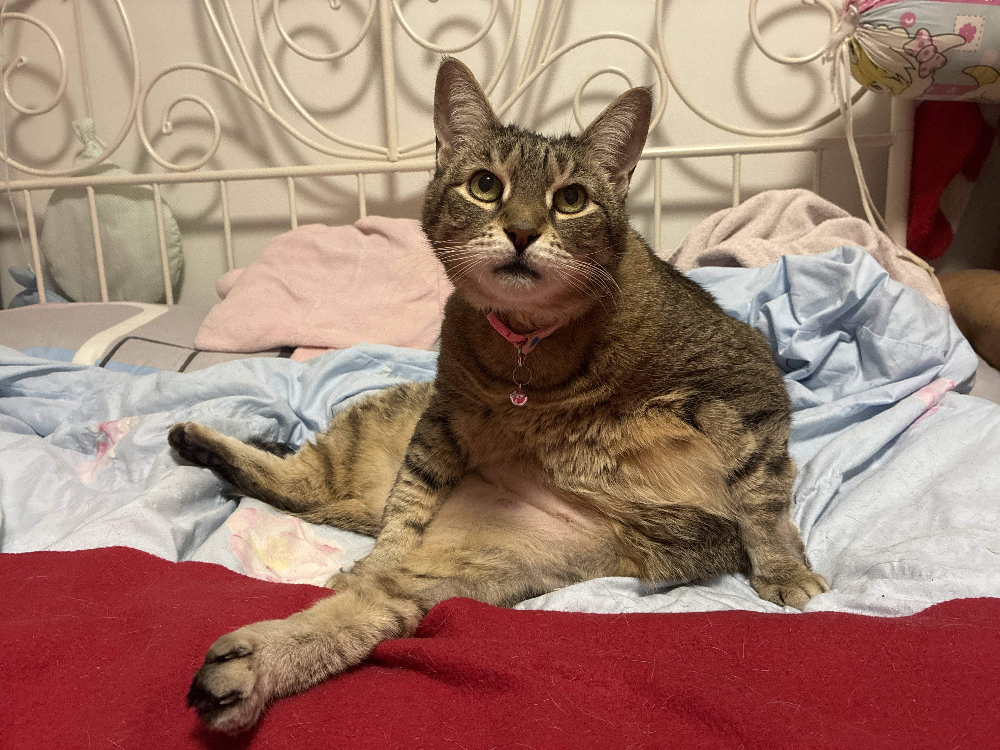
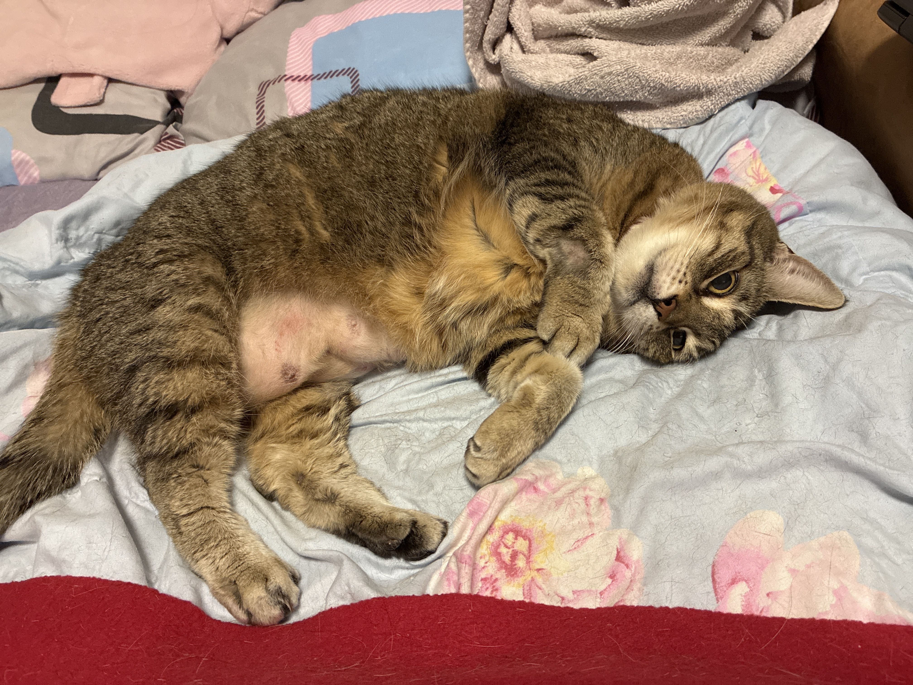
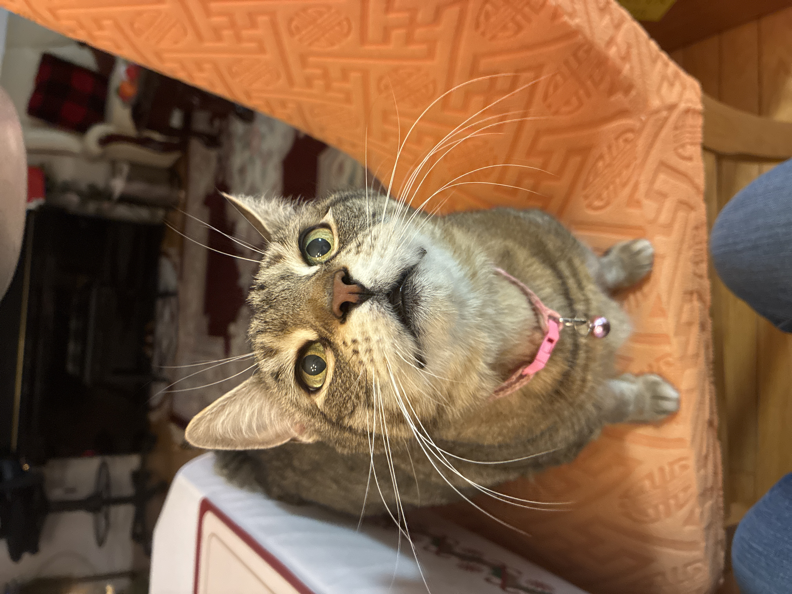

# me0wberry — Fixes Prompt 3
Read this file and apply every fix and addition to index.html.

---

## Fix 1 — Pointier cat ears

Both cat SVGs need pointier, more triangular ears — currently they look too rounded/bunny-like.

**Locations to fix:**
1. The pixel cat face SVG in the bio panel Tab 1 (about) — the ~60×60px kitten avatar
2. The cat SVG icon beside "hello!" in the sidebar nav

For both: make the ears noticeably more pointed/triangular. The ear shape should be a tall narrow triangle pointing upward, not a wide rounded bump. Using rects, achieve this by stacking progressively narrower rects going upward to create a triangular pixel silhouette. The inner ear pink should follow the same narrowing shape inside the outer green ear.

---

## Fix 2 — "♡ him" in likes list

In bio panel Tab 2 (likes), add `♡ him` as the last item in the likes column, after `dreaming & planning`. Style it identically to the other likes items but make it a clickable trigger for the cactus panel:

```html
<li class="ilmbf-trigger" onclick="openPanel('panel-cactus')" style="cursor:inherit; color:var(--pink);">♡ him</li>
```

Subtle hover — slight deepening of pink colour only, no underline, no obvious button appearance.

---

## Fix 3 — Discord kaomoji line break

In bio panel Tab 4 (find me), the disclaimer note currently reads:
```
i don't give out my discord right away — say hi somewhere else first (˶ᵔ ᵕ ᵔ˶)
```

The kaomoji is getting cut off. Fix by putting the kaomoji on its own line using `<br>` — no extra paragraph gap, just a line break:

```html
i don't give out my discord right away — say hi somewhere else first<br>(˶ᵔ ᵕ ᵔ˶)
```

---

## Fix 4 — Single panel open at a time (no stacking)

Currently multiple panels can be open simultaneously which creates an unpleasant layered effect. Change the behaviour so that opening a new panel closes all currently open panels first.

In the `openPanel` function, at the very start (after the `if (!panel) return;` check and after the mobile check), add:

```javascript
// Close all open panels before opening the new one
// Exception: panel-player and panel-cactus stay open regardless
document.querySelectorAll('.panel.open').forEach(p => {
  if (p.id !== 'panel-player' && p.id !== 'panel-cactus') {
    p.classList.remove('open');
  }
});
```

This means:
- Clicking a nav item closes the current content panel and opens the new one
- The music player stays open always (unless manually closed)
- The cactus easter egg stays open always (unless manually closed)
- On mobile the existing behaviour (close all, open one) is unchanged

---

## Addition 1 — Stubby photo slideshow

In `panel-stubby`, replace the current empty posts structure with a photo slideshow at the top of the panel body, above the posts list.

**Slideshow specs:**
- Auto-advances every 8 seconds
- Slides left/right transition between photos (CSS transform translateX, smooth transition ~0.4s)
- Prev (◀) and next (▶) arrow buttons on either side of the image
- Clicking prev/next resets the 8-second auto-advance timer
- Loops back to start after last photo
- Small dot indicators below the image showing current position (filled dot = current, empty = others)
- Dots in `--pink`, small ~6px

**Image constraints:**
- Max height: 220px
- Width: 100% of panel, object-fit: cover
- Images are in `images/stubby/` folder
- Do NOT rename files — use exact filenames as listed

**Starting photos (in order):**
```
1. images/stubby/IMG_5499.JPG   — lounging queen pose
2. images/stubby/IMG_5535.JPG   — post-surgery grumpy side-eye  
3. images/stubby/IMG_5725.JPG   — looking-up beggar pose
```

**Arrow button style:**
- Small pixel-style square buttons matching `.pixel-btn` aesthetic
- `◀` and `▶` inside
- Positioned on the left and right sides of the slideshow, vertically centered on the image
- Semi-transparent frosted background so they're visible over any photo colour

**HTML structure (inside panel-stubby panel-body, before posts section):**

```html
<div class="stubby-slideshow">
  <button class="slide-btn slide-prev" onclick="stubbyPrev()">◀</button>
  <div class="slide-track-wrapper">
    <div class="slide-track" id="stubby-track">
      
      
      
    </div>
  </div>
  <button class="slide-btn slide-next" onclick="stubbyNext()">▶</button>
  <div class="slide-dots" id="stubby-dots"></div>
</div>
```

**Required CSS:**
```css
.stubby-slideshow {
  position: relative;
  margin-bottom: 12px;
}
.slide-track-wrapper {
  overflow: hidden;
  width: 100%;
  border: 1px solid var(--frosted-border);
}
.slide-track {
  display: flex;
  transition: transform 0.4s ease;
}
.slide-img {
  min-width: 100%;
  width: 100%;
  height: 220px;
  object-fit: cover;
  flex-shrink: 0;
}
.slide-btn {
  position: absolute;
  top: 50%;
  transform: translateY(-50%);
  z-index: 2;
  background: rgba(255,255,255,0.6);
  border: 1px solid var(--frosted-border);
  color: var(--pixel-label);
  font-size: 10px;
  width: 24px;
  height: 24px;
  display: flex;
  align-items: center;
  justify-content: center;
  cursor: inherit;
  backdrop-filter: blur(4px);
}
.slide-prev { left: 4px; }
.slide-next { right: 4px; }
.slide-dots {
  display: flex;
  justify-content: center;
  gap: 5px;
  margin-top: 6px;
}
.slide-dot {
  width: 6px;
  height: 6px;
  border-radius: 50%;
  background: var(--pink-pale);
  border: 1px solid var(--pink);
  cursor: inherit;
}
.slide-dot.active {
  background: var(--pink);
}
```

**Required JS (add to script section):**
```javascript
// ── Stubby Slideshow ──
(function() {
  const total = 3;
  let current = 0;
  let timer = null;

  function goTo(n) {
    current = (n + total) % total;
    const track = document.getElementById('stubby-track');
    if (track) track.style.transform = `translateX(-${current * 100}%)`;
    const dots = document.querySelectorAll('.slide-dot');
    dots.forEach((d, i) => d.classList.toggle('active', i === current));
  }

  function startTimer() {
    if (timer) clearInterval(timer);
    timer = setInterval(() => goTo(current + 1), 8000);
  }

  window.stubbyNext = function() { goTo(current + 1); startTimer(); };
  window.stubbyPrev = function() { goTo(current - 1); startTimer(); };

  // Init dots
  document.addEventListener('DOMContentLoaded', function() {
    const dotsEl = document.getElementById('stubby-dots');
    if (dotsEl) {
      for (let i = 0; i < total; i++) {
        const d = document.createElement('div');
        d.className = 'slide-dot' + (i === 0 ? ' active' : '');
        d.onclick = () => { goTo(i); startTimer(); };
        dotsEl.appendChild(d);
      }
    }
    goTo(0);
    startTimer();
  });
})();
```

---

## Notes

- Do not touch panel-player, panel-cactus, or any embed iframes
- Do not modify the posts/ folder structure
- images/stubby/ folder needs to be created — Claude Code can create a placeholder or just reference the path, the actual images will be added manually
